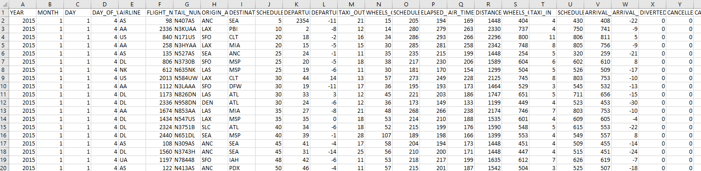
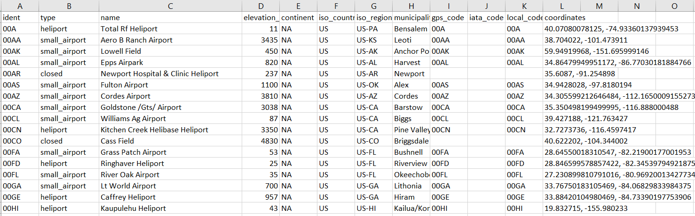

# Airline-OnTime-Performance

## Overview:

The Objective of the project is to generate reports that provides a summary of the on-time arrivals and delays of flights for multiple airlines
-	Percentage of On-time arrivals, departures of flights
-	Percentage of Delayed arrivals, departures of flights
-	Percentage of major reasons of flight delays
-	Percentage of Canceled flights
-	Percentage of Diverted flights
Create Reports at Weekly, Monthly frequencies, which can be filtered for Airlines and Airports.

## Data Sources:

The following data sources will be used to create the final data model which will be used to generate the graphs to capture the On-Time performance of the flights in defined frequencies.

### Flights Log data:

The flights log data contains the arrival, departure details of the flights routes within Unites States (U.S.) for multiple airlines. The data is read on a daily basis to extract the flights data of the previous day and transformed to create the final data model consumed to create the analytics table.

Kaggle Flight Delay and Cancellation data: 
https://www.kaggle.com/usdot/flight-delays?select=flights.csv

Here is the link for the data dictionary of the table attributes:
https://www.transtats.bts.gov/DatabaseInfo.asp?DB_ID=120&DB_Short_Name=On-Time&DB_Name=Airline%20On-Time%20Performance%20Data&Link=0

### Airport and Airline data:

#### Airport:
The Airport data contains the IATA airport code, name of the airport, state, country and co-ordinates.

Data Link:
https://datahub.io/core/airport-codes

#### Airline:
The Airline data contains the Airline ID, Unique Carrier Code, Unique Carrier Name, and regional or not.

Data Link: 
https://www.transtats.bts.gov/tables.asp?Table_ID=304&SYS_Table_Name=T_CARRIER_DECODE

#### Cancellation Code:
The cancellation lookup table contains the cancellation code and its description.

Data:
| Code |	Description |
| --- |	--- |
| A	   | Carrier
|B	   | Weather
|C	   | National Air System
|D	   | Security

