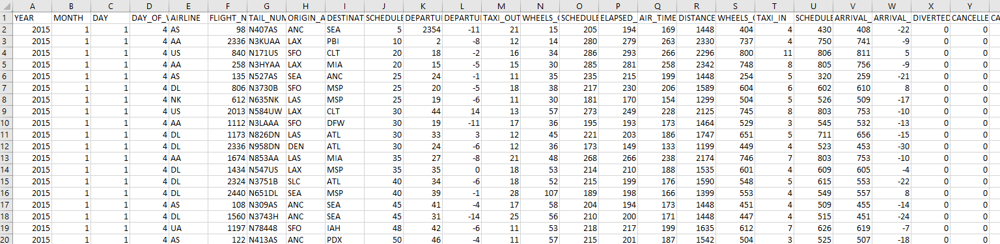

# Airline-OnTime-Performance

## Overview:

The Objective of the project is to generate reports that provides a summary of the on-time arrivals and delays of flights for multiple airlines
-	Percentage of On-time arrivals, departures of flights
-	Percentage of Delayed arrivals, departures of flights
-	Percentage of major reasons of flight delays
-	Percentage of Canceled flights
-	Percentage of Diverted flights
Create Reports at Weekly, Monthly frequencies, which can be filtered for Airlines and Airports.

## Data Sources:

The following data sources will be used to create the final data model which will be used to generate the graphs to capture the On-Time performance of the flights in defined frequencies.

### Flights Log data:

The flights log data contains the arrival, departure details of the flights routes within Unites States (U.S.) for multiple airlines. The data is read on a daily basis to extract the flights data of the previous day and transformed to create the final data model consumed to create the analytics table.

#### Data Source:
https://www.kaggle.com/usdot/flight-delays?select=flights.csv

Here is the link for the data dictionary of the table attributes:
https://www.transtats.bts.gov/DatabaseInfo.asp?DB_ID=120&DB_Short_Name=On-Time&DB_Name=Airline%20On-Time%20Performance%20Data&Link=0

